# ⚡ ESP32 Basics — Wokwi Learning Journey

> A beginner-to-robot course in **16 hands-on labs**, built entirely in the free **[Wokwi](https://wokwi.com) online simulator** – no hardware needed.
> The goal: understand every part well enough to build a **line-following delivery robot**.

   

---

## 📖 Introduction

This repository is my personal engineering notebook. Every lab follows the same recipe:

**Goal → Circuit image → Complete code → Beginner explanation → What I learned → Mini challenge**

Each lab adds *one* new idea to the previous ones, so by Lab 16 nothing in the final robot is a surprise.

## 🧠 What is an ESP32?

The **ESP32** is a small, cheap microcontroller board from Espressif. Think of it as a tiny computer with no screen or keyboard whose only job is to
**read inputs** (buttons, sensors) and **control outputs** (LEDs, motors). It has:

* a dual-core processor running up to 240 MHz,
* built-in **Wi-Fi** and **Bluetooth**,
* dozens of programmable **GPIO** pins,
* an analog-to-digital converter (ADC), PWM hardware, I²C, SPI, UART …

It is programmed here with the **Arduino framework** in C++.

## 🎯 Why I am learning it

I want to build a **line-following delivery robot** that follows a path, avoids obstacles, delivers an item with a servo and reports what it is doing.
That needs sensors, motor control, timing and networking – so I learn each skill separately first.

## 🧪 Wokwi in 60 seconds

[Wokwi](https://wokwi.com) is a browser-based electronics simulator. You drag parts, draw wires, write code and press ▶ – no hardware, no installs.

1. Open <https://wokwi.com> → **New Project → ESP32** (DevKit C v4).
2. Paste the code of a lab into `sketch.ino`.
3. Build the circuit shown in the lab's picture (or paste a `diagram.json`).
4. Click **▶ Start Simulation**. Open the **Serial Monitor** panel to see `Serial` output.
5. Libraries: click the **Library Manager (+)** and add them by name (e.g. *ESP32Servo*, *Adafruit SSD1306*).

> 📸 **About the pictures.** Labs 1 and 2 are my **original Wokwi screenshots**. The other circuit images are drawn in the same style and checked wire-by-wire against the code
> (every wire end sits on a pin and was checked against the code). Only Lab 16 has two places where wires cross; wires that cross **without a dot are never connected**.
>
> ⚠️ Wokwi has **no built-in IR line sensor, L298N driver or DC motor**. Labs 10 and 12–16 therefore show the *real hardware wiring*, and each lab explains how to simulate it.

## 🗺️ Learning roadmap

```
BASICS            INPUTS & TIME        SENSORS & PARTS        ROBOT                   CONNECTED
Lab 1  LED   ──►  Lab 5  ADC     ──►   Lab 8  Ultrasonic ──►  Lab 12 Motor driver ──► Lab 15 Wi-Fi
Lab 2  Button     Lab 6  PWM           Lab 9  Servo           Lab 13 Two motors          │
Lab 3  Serial     Lab 7  millis()      Lab 10 IR sensor       Lab 14 Line following      ▼
Lab 4  Traffic                         Lab 11 OLED (I²C)                           Lab 16 DELIVERY ROBOT
```

| # | Lab | New idea |
|---|---|---|
| 01 | [LED BLINK](#lab-01) | setup / loop / GPIO output |
| 02 | [BUTTON + LED](#lab-02) | input, INPUT_PULLUP, if/else |
| 03 | [SERIAL MONITOR](#lab-03) | Serial debugging |
| 04 | [TRAFFIC LIGHT](#lab-04) | many outputs, sequence |
| 05 | [ANALOG INPUT / ADC](#lab-05) | ADC, analogRead |
| 06 | [PWM / LED DIMMING](#lab-06) | PWM / LEDC |
| 07 | [millis() — NON-BLOCKING TIMING](#lab-07) | non-blocking timing |
| 08 | [ULTRASONIC SENSOR (HC-SR04)](#lab-08) | pulse timing, distance |
| 09 | [SERVO MOTOR](#lab-09) | servo angles |
| 10 | [IR SENSOR](#lab-10) | digital sensors |
| 11 | [OLED DISPLAY (I²C)](#lab-11) | I²C display |
| 12 | [DC MOTOR + MOTOR DRIVER (L298N)](#lab-12) | motor driver, H-bridge |
| 13 | [TWO MOTORS / ROBOT DRIVE](#lab-13) | differential drive |
| 14 | [LINE FOLLOWING](#lab-14) | sensor → decision → motors |
| 15 | [ESP32 WI-FI](#lab-15) | Wi-Fi basics |
| 16 | [FINAL DELIVERY ROBOT](#lab-16) | state machine, everything combined |

## 🧰 Skills learned

* **Digital I/O** – `pinMode`, `digitalWrite`, `digitalRead`, pull-ups
* **Analog I/O** – ADC (`analogRead`), PWM (`ledcWrite`)
* **Debugging** – Serial Monitor
* **Timing** – `delay()` vs `millis()`
* **Sensors** – ultrasonic (HC-SR04), IR, potentiometer
* **Actuators** – LEDs, servo, DC motors with an L298N driver
* **Communication** – I²C (OLED), Wi-Fi
* **Robotics** – differential drive, line following, state machines
* **Electronics basics** – resistors, common ground, why drivers are needed

## 🔌 Quick ESP32 DevKit pin facts used in this course

| Pin(s) | Notes |
|---|---|
| **GPIO 2** | on-board LED pin on many boards, great for first tests |
| **GPIO 34, 35, 36, 39** | **input only** – ideal for sensors, cannot be outputs |
| **GPIO 6–11** | connected to the internal flash – **never use** |
| **GPIO 0, 2, 5, 12, 15** | boot-strapping pins – avoid pulling them wrongly at start-up |
| **3V3 / 5V / GND** | power pins. Logic is **3.3 V** – never feed 5 V into a GPIO |

---

<a name="lab-01"></a>

# 🧪 Lab 01 — LED BLINK

## 🎯 Goal

Make your very first program run on the ESP32: blink an LED on and off once per second.
You will meet the two functions every Arduino-style program has (`setup()` and `loop()`), learn what a **GPIO pin** is, and
see why an LED always needs a **resistor**.

**Parts:** ESP32 DevKit · Red LED · 220 Ω resistor

## 🔌 Circuit

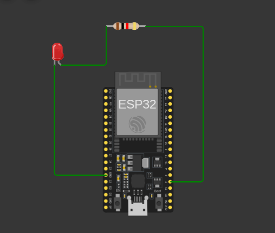

## 💻 Code

```cpp
// Lab 01 - LED Blink
// LED + 220 ohm resistor on GPIO 2, other LED leg to GND.

const int LED_PIN = 2;   // the GPIO pin the LED is connected to

void setup() {
  pinMode(LED_PIN, OUTPUT);   // tell the ESP32 this pin sends signals OUT
}

void loop() {
  digitalWrite(LED_PIN, HIGH); // 3.3 V on the pin -> LED ON
  delay(1000);                 // wait 1 second
  digitalWrite(LED_PIN, LOW);  // 0 V on the pin   -> LED OFF
  delay(1000);                 // wait 1 second
}
```

> 📸 This image is my **original Wokwi screenshot**. The LED is on the left, the resistor on top, and the
> wires run to GPIO 2 (right side of the board) and GND (left side).

### 🔗 Wiring table

| From | To | Purpose |
|---|---|---|
| ESP32 GPIO 2 | 220 Ω resistor (one end) | signal out |
| 220 Ω resistor (other end) | LED anode (long leg / bent leg) | current limited |
| LED cathode (short leg) | ESP32 GND | return path |

## 🧠 Code explained (line by line)

* `const int LED_PIN = 2;`  
  Gives the number 2 a friendly name. Now the code says `LED_PIN` instead of a mystery `2`. `const` means it will never change.
* `void setup() { ... }`  
  Runs **once**, when the ESP32 starts or is reset. Use it for one-time preparation.
* `pinMode(LED_PIN, OUTPUT);`  
  Tells the ESP32 that pin 2 will **send** electricity out (OUTPUT), not listen to it.
* `void loop() { ... }`  
  Runs **over and over forever**, as fast as it can. This is the heartbeat of every project.
* `digitalWrite(LED_PIN, HIGH);`  
  Puts 3.3 V on pin 2. Current flows through the resistor and LED, so the LED turns **ON**.
* `delay(1000);`  
  Freezes the program for 1000 milliseconds (1 second). The LED stays in its current state.
* `digitalWrite(LED_PIN, LOW);`  
  Puts 0 V on pin 2. No current flows, so the LED turns **OFF**.

## 💡 Key ideas

| Word | Beginner meaning |
|---|---|
| **GPIO** | *General Purpose Input/Output* – a pin you can program to send or read signals. |
| **HIGH / LOW** | HIGH = 3.3 V ("on"), LOW = 0 V ("off"). |
| **Resistor** | A part that limits current. Without it the LED would draw too much current and could burn out (or damage the pin). |
| **Anode / cathode** | The LED's `+` leg (anode) and `–` leg (cathode). LEDs only work one way round. |

## ✅ What I learned

- Every program has `setup()` (once) and `loop()` (forever).
- `pinMode()` chooses whether a pin is an OUTPUT or INPUT.
- `digitalWrite()` switches an output between HIGH and LOW.
- An LED always needs a series resistor.
- A circuit needs a complete loop: GPIO → resistor → LED → GND.

## 🚀 Mini challenge

1. Make the LED blink **fast** (100 ms on, 100 ms off).
2. Make a pattern: 3 short blinks, then a 2-second pause (an SOS-style signal).
3. Move the LED to GPIO 4. Which two things must you change – the wire and the code?

[⬆ back to roadmap](#-learning-roadmap)

---

<a name="lab-02"></a>

# 🧪 Lab 02 — BUTTON + LED

## 🎯 Goal

Teach the ESP32 to **listen**. A push button decides whether the LED is on or off.
This is the pattern behind every robot: **input → decision → output**.

**Parts:** ESP32 DevKit · Push button · Red LED · 220 Ω resistor

## 🔌 Circuit

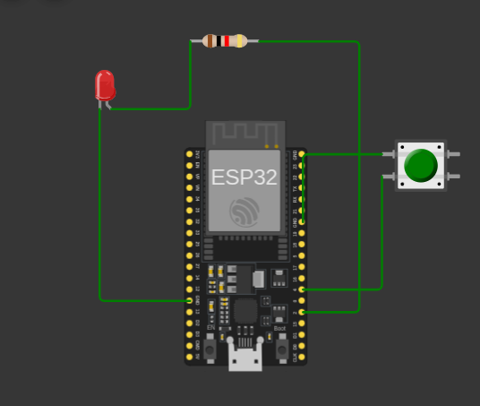

## 💻 Code

```cpp
// Lab 02 - Button + LED
// Button between GPIO 4 and GND (uses the internal pull-up resistor).
// LED + 220 ohm resistor on GPIO 2.

const int BUTTON_PIN = 4;
const int LED_PIN = 2;

void setup() {
  pinMode(BUTTON_PIN, INPUT_PULLUP);  // pin reads HIGH until the button pulls it to GND
  pinMode(LED_PIN, OUTPUT);
}

void loop() {
  int buttonState = digitalRead(BUTTON_PIN);  // read the button: HIGH or LOW

  if (buttonState == LOW) {          // LOW means the button is pressed
    digitalWrite(LED_PIN, HIGH);     // LED ON
  } else {
    digitalWrite(LED_PIN, LOW);      // LED OFF
  }
}
```

> 📸 Again my **original Wokwi screenshot**. If your screenshot has the button's GND wire on a different GND pin, that is fine –
> all GND pins are connected together inside the ESP32.

### 🔗 Wiring table

| From | To | Purpose |
|---|---|---|
| ESP32 GPIO 2 | 220 Ω resistor → LED anode | LED output |
| LED cathode | ESP32 GND (left side) | return path |
| Button, left-bottom leg | ESP32 GPIO 4 | button input |
| Button, left-top leg | ESP32 GND | pressed = connected to GND |

## 🧠 Code explained (line by line)

* `const int BUTTON_PIN = 4;`  
  Names the pin the button is connected to.
* `pinMode(BUTTON_PIN, INPUT_PULLUP);`  
  Makes pin 4 an **input** and switches on a tiny resistor inside the ESP32 that gently pulls the pin up to HIGH. So the pin reads HIGH when nothing is pressed.
* `int buttonState = digitalRead(BUTTON_PIN);`  
  Looks at the pin and stores the answer (HIGH or LOW) in a variable called `buttonState`.
* `if (buttonState == LOW) { ... }`  
  `==` means "is equal to". When the button is pressed it connects the pin to GND, so the pin reads **LOW**. The code inside the braces runs only then: LED ON.
* `else { ... }`  
  If the `if` was not true (button not pressed), do this instead: LED OFF.

## 💡 Key ideas

**Why INPUT_PULLUP?** A pin that is connected to nothing "floats" – it reads random HIGH/LOW noise.
`INPUT_PULLUP` gives the pin a default value (HIGH). Pressing the button connects it to GND, so the reading becomes LOW.
That is why the logic looks *backwards*: **pressed = LOW**.

```
INPUT  ──►  DECISION  ──►  OUTPUT
button      if / else      LED
```

## ✅ What I learned

- `INPUT_PULLUP` removes the need for an external resistor.
- With a pull-up, a pressed button reads **LOW**.
- `digitalRead()` reads a pin; `if / else` makes decisions.
- Every program is: read input → decide → write output.

## 🚀 Mini challenge

1. Reverse the logic: the LED is normally ON and turns OFF while you hold the button.
2. Make the button **toggle** the LED (press once = on, press again = off). Hint: you need a variable that remembers the state.

[⬆ back to roadmap](#-learning-roadmap)

---

<a name="lab-03"></a>

# 🧪 Lab 03 — SERIAL MONITOR

## 🎯 Goal

Make the ESP32 **talk to you**. Using the Serial Monitor you can print messages and variable values while the program runs –
the number-one tool for finding bugs.

**Parts:** ESP32 DevKit · Push button · Red LED · 220 Ω resistor

## 🔌 Circuit

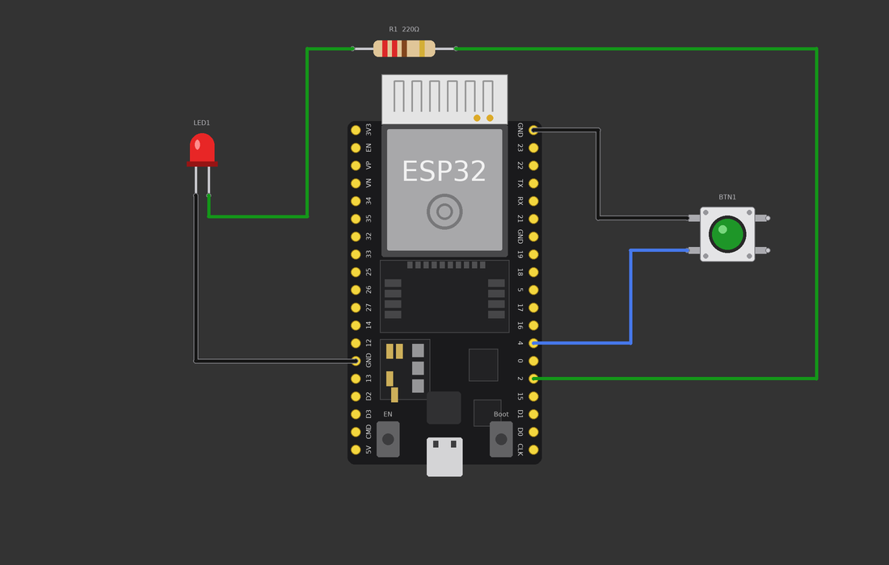

## 💻 Code

```cpp
// Lab 03 - Serial Monitor
// Same circuit as Lab 02 (button on GPIO 4, LED on GPIO 2),
// but now the ESP32 TELLS us what it is thinking.

const int BUTTON_PIN = 4;
const int LED_PIN = 2;

int pressCount = 0;          // how many times the button was pressed
int lastState = HIGH;        // previous button reading (HIGH = not pressed)

void setup() {
  Serial.begin(115200);      // start the Serial Monitor at 115200 baud
  pinMode(BUTTON_PIN, INPUT_PULLUP);
  pinMode(LED_PIN, OUTPUT);
  Serial.println("ESP32 is ready!");
}

void loop() {
  int state = digitalRead(BUTTON_PIN);

  if (state == LOW) {
    digitalWrite(LED_PIN, HIGH);
  } else {
    digitalWrite(LED_PIN, LOW);
  }

  // Count only the moment the button goes from "not pressed" to "pressed"
  if (state == LOW && lastState == HIGH) {
    pressCount++;
    Serial.print("Button pressed! Count = ");
    Serial.println(pressCount);
  }
  lastState = state;

  delay(20);                 // small pause so we do not flood the monitor
}
```

> 💡 The circuit is the same as Lab 2 – only the **code** changes. The messages appear in Wokwi's **Serial Monitor** panel
> (the black console under the editor).

### 🔗 Wiring table

| From | To | Purpose |
|---|---|---|
| ESP32 GPIO 2 | 220 Ω resistor → LED anode | LED output |
| LED cathode | ESP32 GND | return path |
| Button, left-bottom leg | ESP32 GPIO 4 | button input |
| Button, left-top leg | ESP32 GND | pressed = connected to GND |

## 🧠 Code explained (line by line)

* `Serial.begin(115200);`  
  Opens the communication line to your computer at 115200 *baud* (bits per second). The Serial Monitor must use the same speed.
* `Serial.println("ESP32 is ready!");`  
  Prints text and then jumps to a new line (`ln` = *line*).
* `Serial.print("Button pressed! Count = ");`  
  Prints text but **stays on the same line**, so the next print continues after it.
* `int pressCount = 0;`  
  A variable (a labelled box) that remembers how many presses happened.
* `int lastState = HIGH;`  
  Remembers what the button was doing **last time** around the loop.
* `if (state == LOW && lastState == HIGH)`  
  `&&` means AND. This is true only at the *moment* the button changes from not-pressed to pressed – so we count one press, not hundreds.
* `pressCount++;`  
  Adds 1 to `pressCount`.
* `delay(20);`  
  A tiny pause so the Serial Monitor is not flooded and the button is not read thousands of times a second.

## 💡 Key ideas

**Why is the Serial Monitor so useful?** An ESP32 has no screen. When something does not work you are blind:
is the button being read? Is the variable what you think it is? `Serial.print` lets you *see inside* the program.
Professional engineers do this every day – it is called **debugging**.

Tip: print the **name and the value** (`"Count = "` then the number), otherwise you will not know which number is which.

## ✅ What I learned

- `Serial.begin()` starts serial; `print` / `println` send text and values.
- Printing variables lets you check what the ESP32 is really doing (debugging).
- Remembering the previous state detects a *change* (an event) instead of a *level*.
- `&&` combines two conditions.

## 🚀 Mini challenge

1. Also print `"Button released"` when the button is let go.
2. Print how many **milliseconds** the button was held (hint: `millis()` – you meet it in Lab 7).

[⬆ back to roadmap](#-learning-roadmap)

---

<a name="lab-04"></a>

# 🧪 Lab 04 — TRAFFIC LIGHT

## 🎯 Goal

Control **three outputs in a sequence**. You will wire three LEDs, give each its own resistor and pin, and write a
program that steps through red → green → yellow like a real traffic light.

**Parts:** ESP32 DevKit · Red, yellow and green LEDs · 3 × 220 Ω resistors

## 🔌 Circuit

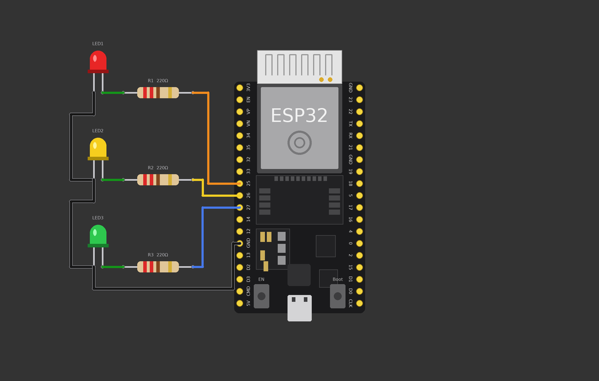

## 💻 Code

```cpp
// Lab 04 - Traffic Light
// Red LED = GPIO 25, Yellow LED = GPIO 26, Green LED = GPIO 27
// (each LED has its own 220 ohm resistor, all LED cathodes go to GND)

const int RED_PIN = 25;
const int YELLOW_PIN = 26;
const int GREEN_PIN = 27;

void setup() {
  pinMode(RED_PIN, OUTPUT);
  pinMode(YELLOW_PIN, OUTPUT);
  pinMode(GREEN_PIN, OUTPUT);
}

void loop() {
  // RED - stop
  digitalWrite(RED_PIN, HIGH);
  digitalWrite(YELLOW_PIN, LOW);
  digitalWrite(GREEN_PIN, LOW);
  delay(3000);

  // GREEN - go
  digitalWrite(RED_PIN, LOW);
  digitalWrite(GREEN_PIN, HIGH);
  delay(3000);

  // YELLOW - get ready to stop
  digitalWrite(GREEN_PIN, LOW);
  digitalWrite(YELLOW_PIN, HIGH);
  delay(1000);

  digitalWrite(YELLOW_PIN, LOW);   // then the loop starts again with RED
}
```

> 🔗 The three cathodes are chained together and go to **one** GND pin. Every LED still has its **own** resistor.

### 🔗 Wiring table

| From | To | Purpose |
|---|---|---|
| GPIO 25 | R1 → red LED anode | RED |
| GPIO 26 | R2 → yellow LED anode | YELLOW |
| GPIO 27 | R3 → green LED anode | GREEN |
| All three LED cathodes (joined in a chain) | ESP32 GND | shared ground |

## 🧠 Code explained (line by line)

* `const int RED_PIN = 25; ...`  
  One named constant per LED. If you move a wire later you change just one line.
* `pinMode(..., OUTPUT);  (three times)`  
  Every LED pin must be declared as an OUTPUT.
* `digitalWrite(RED_PIN, HIGH); ... LOW; LOW;`  
  Red ON, the other two OFF. Setting *all three* every step avoids two lights being on by mistake.
* `delay(3000);`  
  Hold this state for 3 seconds.
* `// GREEN ... // YELLOW`  
  Same idea for the next steps. The sequence is the order of the lines.
* `end of loop()`  
  When `loop()` finishes it starts again from the top – red again. The traffic light never stops.

## 💡 Key ideas

**Organising variables:** put pin numbers at the top as `const int` names. Code like `digitalWrite(RED_PIN, HIGH)` reads like
English, and it is easy to change.

**Sequential control:** a program runs line by line. The order of your lines *is* the behaviour.

## ✅ What I learned

- Use one GPIO + one resistor per LED.
- LEDs can share a common GND.
- Named constants make code readable.
- Order of instructions = order of events.

## 🚀 Mini challenge

1. Add a pedestrian button (Lab 2 style) that forces the light to red.
2. Real lights show red + yellow together before green. Add that step.
3. Use a `for` loop to blink the green LED 3 times before it turns yellow.

[⬆ back to roadmap](#-learning-roadmap)

---

<a name="lab-05"></a>

# 🧪 Lab 05 — ANALOG INPUT / ADC

## 🎯 Goal

Read a **range of values**, not just ON/OFF. A potentiometer (a turnable knob) changes a voltage smoothly; the ESP32's
**ADC** (Analog-to-Digital Converter) turns that voltage into a number from 0 to 4095.

**Parts:** ESP32 DevKit · Potentiometer

## 🔌 Circuit

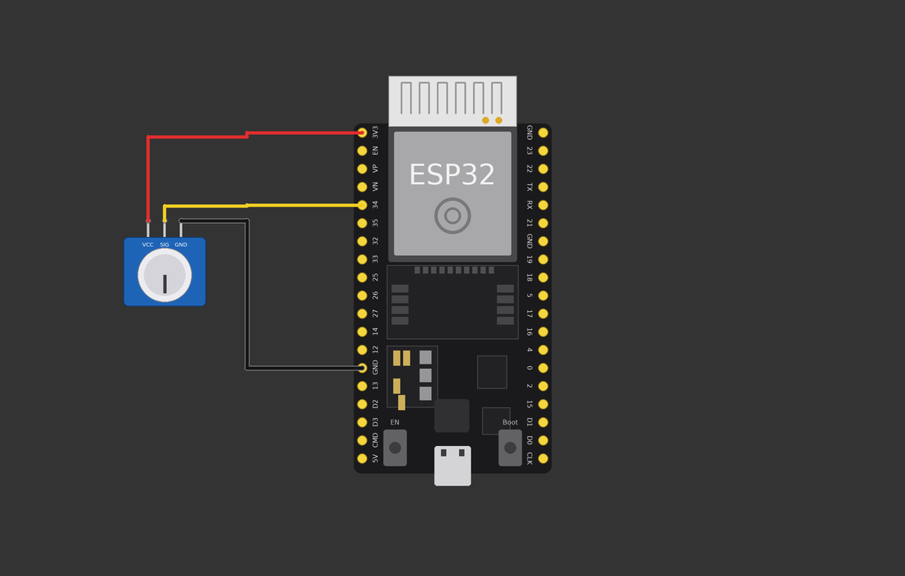

## 💻 Code

```cpp
// Lab 05 - Analog input (ADC) with a potentiometer
// Pot: VCC -> 3V3, GND -> GND, SIG (middle pin) -> GPIO 34

const int POT_PIN = 34;   // GPIO 34 is an input-only ADC pin

void setup() {
  Serial.begin(115200);
}

void loop() {
  int raw = analogRead(POT_PIN);                 // 0 ... 4095
  float volts = raw * 3.3 / 4095.0;              // convert to volts
  int percent = map(raw, 0, 4095, 0, 100);       // convert to 0-100 %

  Serial.print("ADC = ");
  Serial.print(raw);
  Serial.print("   Voltage = ");
  Serial.print(volts, 2);
  Serial.print(" V   Percent = ");
  Serial.print(percent);
  Serial.println(" %");

  delay(200);
}
```

> 💡 Use only **ADC1** pins (GPIO 32–39) once Wi-Fi is on (Lab 15). GPIO 34 is input-only, which is perfect for sensors.

### 🔗 Wiring table

| From | To | Purpose |
|---|---|---|
| Pot VCC | ESP32 3V3 | power |
| Pot GND | ESP32 GND | ground |
| Pot SIG (middle pin) | ESP32 GPIO 34 | analog signal |

## 🧠 Code explained (line by line)

* `const int POT_PIN = 34;`  
  The pin that listens to the pot's middle terminal.
* `int raw = analogRead(POT_PIN);`  
  Measures the voltage on the pin and returns a number: **0** = 0 V, **4095** = 3.3 V.
* `float volts = raw * 3.3 / 4095.0;`  
  Converts the number back to volts. `float` is a variable that can hold decimals.
* `int percent = map(raw, 0, 4095, 0, 100);`  
  `map()` rescales a number from one range to another – here 0–4095 becomes 0–100 %.
* `Serial.print(volts, 2);`  
  Prints the decimal number with **2** digits after the point.

## 💡 Key ideas

**What is a potentiometer?** A resistor with a sliding contact. The two outer pins go to 3.3 V and GND; the middle pin gives
anything *between* them depending on the knob position.

**Why 0–4095?** The ESP32 ADC has **12 bits**: 2¹² = 4096 possible values. Each step ≈ 0.8 mV.

Many real sensors (light, temperature, distance) also output a changing voltage – a pot is the best way to practise.

## ✅ What I learned

- `analogRead()` returns 0–4095 on the ESP32.
- ADC = turning a voltage into a number.
- `map()` rescales values; `float` stores decimals.
- Turning the knob changes the voltage smoothly.

## 🚀 Mini challenge

1. Turn the LED from Lab 1 on only when the knob is above 50 %.
2. Print `LOW`, `MEDIUM` or `HIGH` depending on which third of the range the value is in.

[⬆ back to roadmap](#-learning-roadmap)

---

<a name="lab-06"></a>

# 🧪 Lab 06 — PWM / LED DIMMING

## 🎯 Goal

Digital pins are only ON or OFF – so how do you get **half brightness** or a slow motor? With **PWM** (Pulse-Width Modulation):
switching ON/OFF thousands of times a second and changing how long it stays ON.

**Parts:** ESP32 DevKit · Red LED · 220 Ω resistor

## 🔌 Circuit

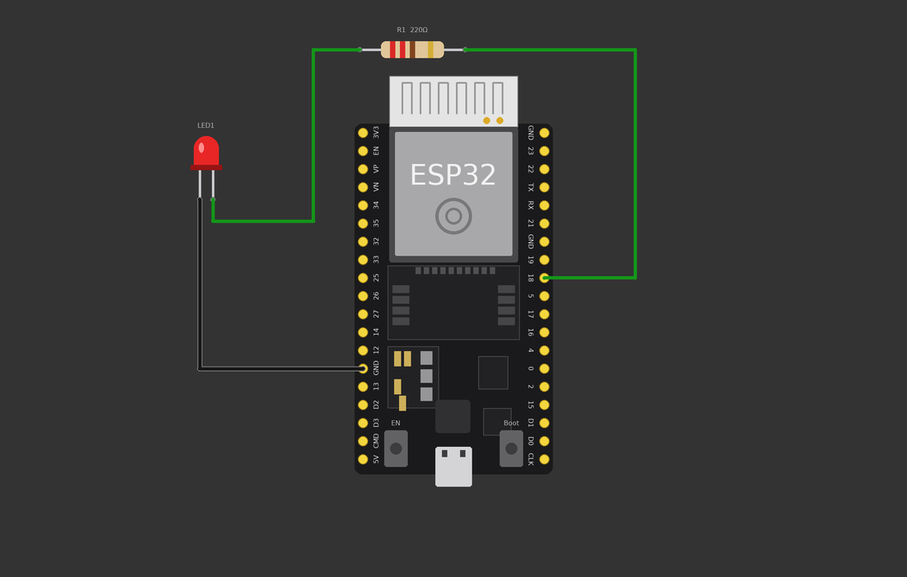

## 💻 Code

```cpp
// Lab 06 - PWM LED dimming (needs ESP32 Arduino core 3.x, which Wokwi uses)
// LED + 220 ohm resistor on GPIO 18.

const int LED_PIN = 18;
const int PWM_FREQ = 5000;       // 5000 flashes per second
const int PWM_RESOLUTION = 8;    // 8 bits -> duty values 0 ... 255

void setup() {
  ledcAttach(LED_PIN, PWM_FREQ, PWM_RESOLUTION);  // set up PWM on this pin
}

void loop() {
  // fade IN: dark -> bright
  for (int duty = 0; duty <= 255; duty++) {
    ledcWrite(LED_PIN, duty);
    delay(8);
  }
  // fade OUT: bright -> dark
  for (int duty = 255; duty >= 0; duty--) {
    ledcWrite(LED_PIN, duty);
    delay(8);
  }
}
```

> ⚙️ This lab uses the **ESP32 Arduino core 3.x** functions `ledcAttach()` / `ledcWrite()` (current Wokwi default). Older tutorials
> use `ledcSetup()` + `ledcAttachPin()` – those are the 2.x names.

### 🔗 Wiring table

| From | To | Purpose |
|---|---|---|
| ESP32 GPIO 18 | 220 Ω resistor → LED anode | PWM output |
| LED cathode | ESP32 GND | return path |

## 🧠 Code explained (line by line)

* `const int PWM_FREQ = 5000;`  
  The pin switches ON/OFF 5000 times per second – too fast for the eye, so we see a steady brightness.
* `const int PWM_RESOLUTION = 8;`  
  Duty values have 8 bits: 0 … 255.
* `ledcAttach(LED_PIN, PWM_FREQ, PWM_RESOLUTION);`  
  Gives the pin to a **LEDC** channel (the ESP32's built-in PWM hardware).
* `ledcWrite(LED_PIN, duty);`  
  Sets the **duty cycle**: 0 = always off, 255 = always on, 128 ≈ on half of the time = half brightness.
* `for (int duty = 0; duty <= 255; duty++)`  
  A loop that counts from 0 to 255 – the LED slowly brightens.

## 💡 Key ideas

**ON/OFF vs PWM**

| | `digitalWrite` | PWM (`ledcWrite`) |
|---|---|---|
| Values | HIGH or LOW | 0 – 255 |
| LED | on or off | any brightness |
| Motor | stopped / full speed | any speed |

**Duty cycle** = percentage of time the signal is HIGH. 25 % duty ≈ dim, 75 % ≈ bright.
PWM is exactly how you will control **motor speed** in Labs 12–16.

## ✅ What I learned

- PWM fakes an analog output with fast ON/OFF pulses.
- Duty cycle controls brightness (or motor speed).
- ESP32 PWM = LEDC: `ledcAttach` once, `ledcWrite` often.
- Resolution 8 bit = 0–255.

## 🚀 Mini challenge

1. Connect the pot from Lab 5 and make the knob control the LED brightness (`map(raw, 0, 4095, 0, 255)`).
2. Make a 'breathing' LED with a slower fade.

[⬆ back to roadmap](#-learning-roadmap)

---

<a name="lab-07"></a>

# 🧪 Lab 07 — millis() — NON-BLOCKING TIMING

## 🎯 Goal

`delay()` freezes the whole ESP32. Here two LEDs blink at **different speeds at the same time** using `millis()`,
the clock that lets the program keep doing other things while it waits.

**Parts:** ESP32 DevKit · 2 LEDs (red, blue) · 2 × 220 Ω resistors

## 🔌 Circuit

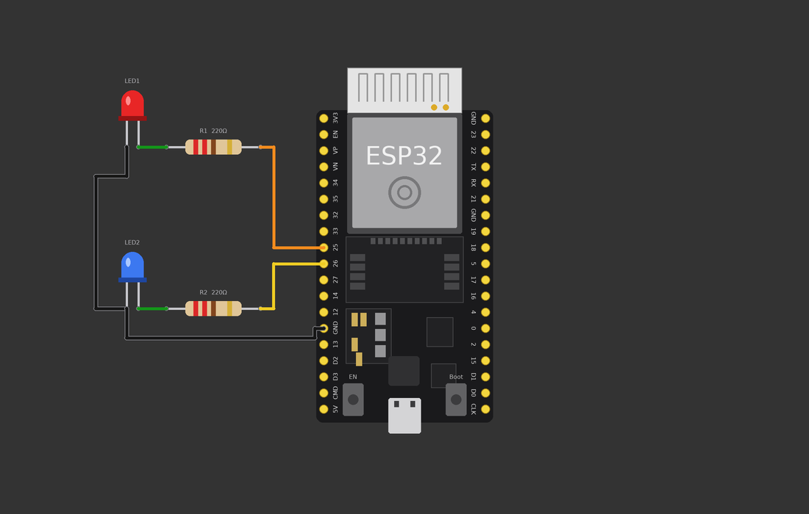

## 💻 Code

```cpp
// Lab 07 - millis(): two LEDs blinking at different speeds at the same time
// LED1 (GPIO 25) blinks every 500 ms, LED2 (GPIO 26) blinks every 1300 ms.

const int LED1_PIN = 25;
const int LED2_PIN = 26;

const unsigned long INTERVAL1 = 500;    // ms
const unsigned long INTERVAL2 = 1300;   // ms

unsigned long previous1 = 0;   // last time LED1 changed
unsigned long previous2 = 0;   // last time LED2 changed
bool led1State = false;
bool led2State = false;

void setup() {
  pinMode(LED1_PIN, OUTPUT);
  pinMode(LED2_PIN, OUTPUT);
}

void loop() {
  unsigned long now = millis();            // milliseconds since the ESP32 started

  if (now - previous1 >= INTERVAL1) {      // has 500 ms passed?
    previous1 = now;
    led1State = !led1State;                // flip ON <-> OFF
    digitalWrite(LED1_PIN, led1State);
  }

  if (now - previous2 >= INTERVAL2) {      // has 1300 ms passed?
    previous2 = now;
    led2State = !led2State;
    digitalWrite(LED2_PIN, led2State);
  }

  // loop() keeps running freely - we could read sensors here too!
}
```

> **Simple example first:** with `delay()` you can blink *one* LED easily. Try blinking two at different speeds with `delay()` –
> it is nearly impossible, because while the program waits for one LED it cannot touch the other.

### 🔗 Wiring table

| From | To | Purpose |
|---|---|---|
| GPIO 25 | R1 → red LED anode | LED1, 500 ms |
| GPIO 26 | R2 → blue LED anode | LED2, 1300 ms |
| Both LED cathodes (chained) | ESP32 GND | shared ground |

## 🧠 Code explained (line by line)

* `unsigned long now = millis();`  
  `millis()` = milliseconds since the ESP32 started. It keeps counting by itself. `unsigned long` is a big, never-negative whole number.
* `const unsigned long INTERVAL1 = 500;`  
  How long LED1 waits between changes.
* `unsigned long previous1 = 0;`  
  The time (from `millis()`) when LED1 last changed.
* `if (now - previous1 >= INTERVAL1)`  
  **Elapsed time = now − last time.** If at least 500 ms have passed, it is time to act.
* `previous1 = now;`  
  Remember *this* moment as the new 'last time'.
* `led1State = !led1State;`  
  `!` means NOT: ON becomes OFF, OFF becomes ON.
* `loop() never waits`  
  Both `if` blocks are checked thousands of times per second, so each LED keeps its own rhythm.

## 💡 Key ideas

**Why `millis()` matters for robotics.** A line-following robot must read sensors, correct motors, check for obstacles and update a
display – *all at once*. If any part uses `delay(1000)`, the robot is blind and deaf for a whole second and drives off the line.
Non-blocking code with `millis()` is how robots multitask.

```
delay():   [wait.................] ← nothing else can run
millis():  check A  check B  check A  check B  check A ...  ← everything keeps running
```

## ✅ What I learned

- `delay()` blocks; `millis()` does not.
- Elapsed time = `millis()` − previous time.
- One `previous` variable per timed task.
- Non-blocking timing is essential for robots.

## 🚀 Mini challenge

1. Add a third LED that blinks every 250 ms.
2. Print a message to Serial every 2 seconds using the same technique.

[⬆ back to roadmap](#-learning-roadmap)

---

<a name="lab-08"></a>

# 🧪 Lab 08 — ULTRASONIC SENSOR (HC-SR04)

## 🎯 Goal

Measure **distance** with sound. The HC-SR04 sends an ultrasonic ping and listens for the echo; the ESP32 measures how long it took and
converts that time into centimetres – the basis of **obstacle detection**.

**Parts:** ESP32 DevKit · HC-SR04 ultrasonic sensor

## 🔌 Circuit

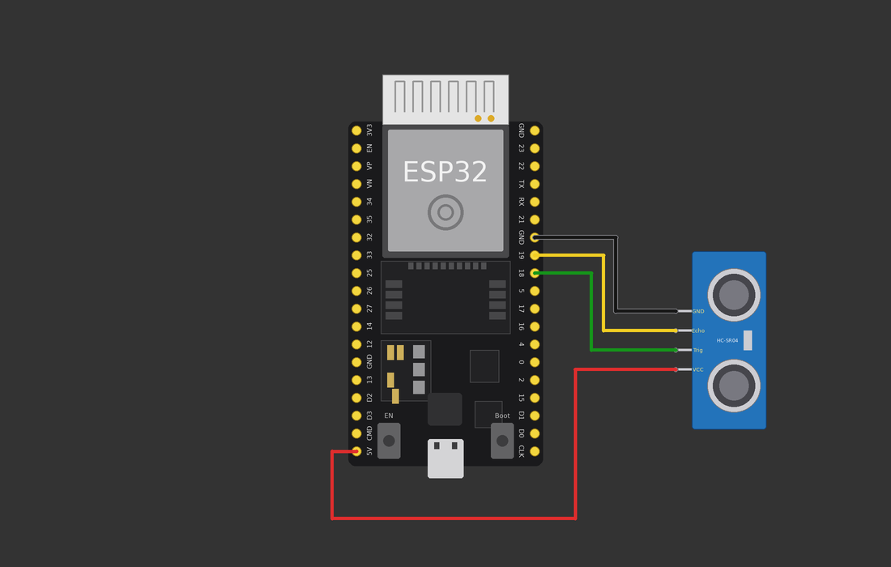

## 💻 Code

```cpp
// Lab 08 - Ultrasonic sensor HC-SR04
// VCC -> 5V, GND -> GND, TRIG -> GPIO 18, ECHO -> GPIO 19
// (On real hardware put a voltage divider on ECHO: it outputs 5 V.)

const int TRIG_PIN = 18;
const int ECHO_PIN = 19;

void setup() {
  Serial.begin(115200);
  pinMode(TRIG_PIN, OUTPUT);   // we send the trigger pulse
  pinMode(ECHO_PIN, INPUT);    // we listen for the echo
}

void loop() {
  // 1. send a clean 10 microsecond pulse on TRIG
  digitalWrite(TRIG_PIN, LOW);
  delayMicroseconds(2);
  digitalWrite(TRIG_PIN, HIGH);
  delayMicroseconds(10);
  digitalWrite(TRIG_PIN, LOW);

  // 2. measure how long ECHO stays HIGH (microseconds)
  long duration = pulseIn(ECHO_PIN, HIGH, 30000);   // give up after 30 ms

  // 3. convert time to distance
  if (duration == 0) {
    Serial.println("No echo (too far or nothing in front)");
  } else {
    float distance = duration * 0.0343 / 2;         // centimetres
    Serial.print("Distance: ");
    Serial.print(distance, 1);
    Serial.println(" cm");

    if (distance < 20) {
      Serial.println("  -> OBSTACLE!");
    }
  }
  delay(300);
}
```

> ⚠️ **Real hardware:** ECHO outputs **5 V**, but ESP32 pins tolerate only **3.3 V**. On a real robot put a voltage divider on ECHO
> (e.g. 1 kΩ in series, 2 kΩ to GND) or use a 3.3 V-compatible sensor. Wokwi does not need it.
>
> 🖱️ In Wokwi, click the sensor while the simulation runs and drag the *Distance* slider.

### 🔗 Wiring table

| From | To | Purpose |
|---|---|---|
| HC-SR04 VCC | ESP32 5V | power |
| HC-SR04 GND | ESP32 GND | ground |
| HC-SR04 TRIG | ESP32 GPIO 18 | ESP32 sends the trigger pulse |
| HC-SR04 ECHO | ESP32 GPIO 19 | sensor returns the echo pulse |

## 🧠 Code explained (line by line)

* `pinMode(TRIG_PIN, OUTPUT); pinMode(ECHO_PIN, INPUT);`  
  TRIG is an output (we talk to the sensor), ECHO is an input (the sensor talks to us).
* `digitalWrite(TRIG_PIN, LOW); delayMicroseconds(2);`  
  Make sure the line starts quiet.
* `digitalWrite(TRIG_PIN, HIGH); delayMicroseconds(10); digitalWrite(TRIG_PIN, LOW);`  
  A 10-microsecond pulse tells the sensor: *send a ping now*.
* `long duration = pulseIn(ECHO_PIN, HIGH, 30000);`  
  Measures how long ECHO stays HIGH, in microseconds. That is the time sound took to go to the object **and back**. `30000` is a time-out (30 ms) so the code never waits forever.
* `float distance = duration * 0.0343 / 2;`  
  The formula – explained below.
* `if (distance < 20) ...`  
  Obstacle detection: closer than 20 cm means *obstacle!*.

## 💡 Key ideas

**The formula in plain words**

1. Sound travels about **343 m/s** = **0.0343 cm per microsecond**.
2. `duration` is the time for the **round trip** (there *and* back).
3. We only want the one-way distance, so we divide by **2**.

> distance (cm) = duration (µs) × 0.0343 ÷ 2

Example: duration = 1166 µs → 1166 × 0.0343 ÷ 2 ≈ **20 cm**.

If `pulseIn` returns 0, nothing was heard (too far / no object) – treat it as "no reading".

## ✅ What I learned

- TRIG sends a pulse, ECHO returns a pulse; its **length** is the distance.
- `pulseIn()` measures pulse length in µs.
- distance = time × speed of sound ÷ 2.
- Comparing a distance with a threshold detects obstacles.

## 🚀 Mini challenge

1. Make an LED (Lab 1) turn on when an object is closer than 15 cm.
2. Print `FAR`, `NEAR` or `TOO CLOSE` for three distance zones.
3. Take the average of 5 readings to smooth the noise.

[⬆ back to roadmap](#-learning-roadmap)

---

<a name="lab-09"></a>

# 🧪 Lab 09 — SERVO MOTOR

## 🎯 Goal

Move something to an **exact angle**. A servo has a motor, gears and a position sensor inside – you tell it an angle and it goes there.
In the final robot a servo will drop the delivery.

**Parts:** ESP32 DevKit · Servo (SG90-style)

## 🔌 Circuit

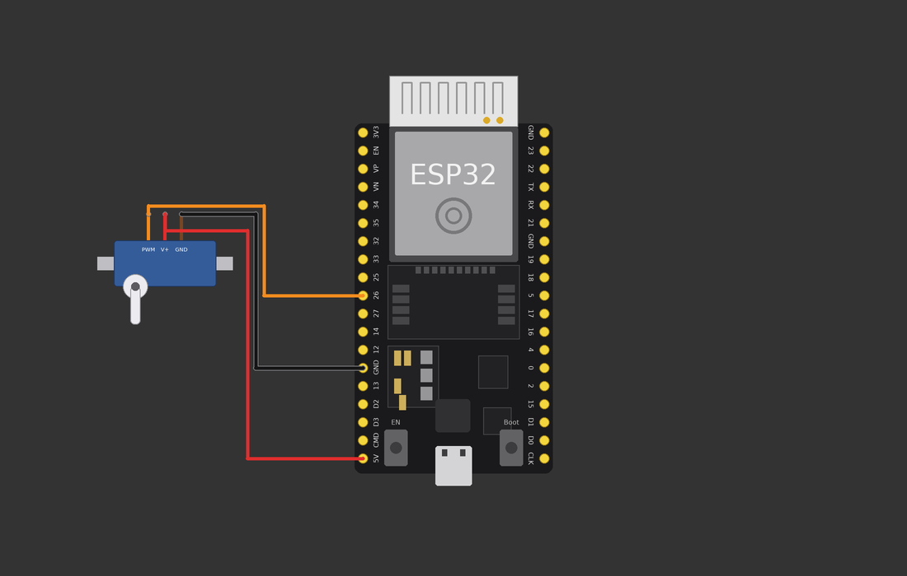

## 💻 Code

```cpp
// Lab 09 - Servo motor
// Servo: signal (orange) -> GPIO 26, V+ (red) -> 5V, GND (brown) -> GND
// Library: ESP32Servo (add it in Wokwi's Library Manager)

#include <ESP32Servo.h>

const int SERVO_PIN = 26;
Servo myServo;

void setup() {
  myServo.attach(SERVO_PIN);   // connect the Servo object to the pin
}

void loop() {
  myServo.write(0);            // 0 degrees   (one end)
  delay(1000);
  myServo.write(90);           // 90 degrees  (middle)
  delay(1000);
  myServo.write(180);          // 180 degrees (other end)
  delay(1000);

  // slow sweep back from 180 to 0
  for (int angle = 180; angle >= 0; angle--) {
    myServo.write(angle);
    delay(15);
  }
}
```

> 📦 Add the **ESP32Servo** library: in Wokwi click the library icon (`+`) → search *ESP32Servo*.
>
> ⚠️ On real hardware a servo can draw a lot of current; large servos need their own supply (with common GND).

### 🔗 Wiring table

| From | To | Purpose |
|---|---|---|
| Servo signal (orange, PWM) | ESP32 GPIO 26 | angle command |
| Servo V+ (red) | ESP32 5V | power |
| Servo GND (brown) | ESP32 GND | ground |

## 🧠 Code explained (line by line)

* `#include <ESP32Servo.h>`  
  Loads the library that knows how to talk to servos.
* `Servo myServo;`  
  Creates a servo object – think of it as a remote control for one servo.
* `myServo.attach(SERVO_PIN);`  
  Tells the object which pin the signal wire is on.
* `myServo.write(90);`  
  Moves to 90°. The library generates the correct PWM signal for you.
* `for (int angle = 180; angle >= 0; angle--)`  
  Counting down one degree at a time with a tiny delay makes a smooth, slow sweep.

## 💡 Key ideas

**0° to 180°:** 0° is one end of travel, 90° the middle, 180° the other end – half a turn in total.

**PWM again:** a servo expects a pulse every 20 ms. The pulse *width* is the command: about 0.5 ms = 0°, 1.5 ms = 90°, 2.5 ms = 180°.
The Servo library creates that signal so you only write angles.

## ✅ What I learned

- A servo moves to an angle you choose (0–180°).
- A servo has three wires: signal, power, ground.
- `attach()` once, then `write(angle)`.
- Servo position is controlled by PWM pulse width.

## 🚀 Mini challenge

1. Control the servo angle with the potentiometer from Lab 5 (`map(raw, 0, 4095, 0, 180)`).
2. Make the servo open a 'gate' to 90° for 2 seconds when a button is pressed.

[⬆ back to roadmap](#-learning-roadmap)

---

<a name="lab-10"></a>

# 🧪 Lab 10 — IR SENSOR

## 🎯 Goal

Detect a surface with a **digital sensor**. An IR module shines infrared light and checks how much comes back: light surfaces reflect a lot,
black surfaces reflect almost none – perfect for **line detection**.

**Parts:** ESP32 DevKit · IR line/obstacle sensor module · Red LED + 220 Ω resistor (indicator)

## 🔌 Circuit

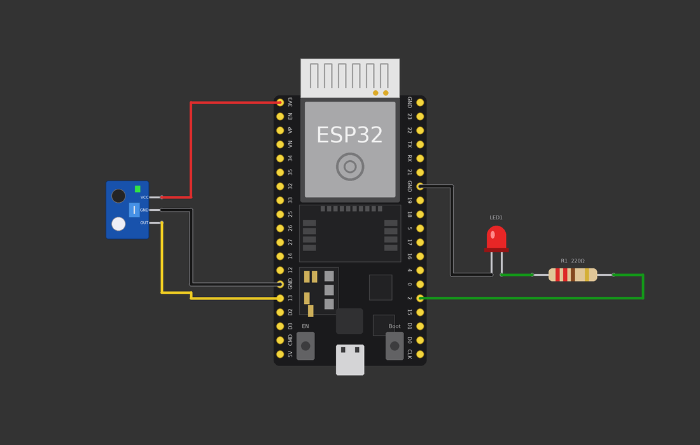

## 💻 Code

```cpp
// Lab 10 - IR sensor (digital output)
// IR module: VCC -> 3V3, GND -> GND, OUT -> GPIO 13
// Indicator LED + 220 ohm resistor on GPIO 2.
// NOTE: Wokwi has no built-in IR line sensor. In the simulator, wire a slide
// switch (middle pin -> GPIO 13, side pins -> 3V3 and GND) to play the sensor.

const int IR_PIN = 13;
const int LED_PIN = 2;

void setup() {
  Serial.begin(115200);
  pinMode(IR_PIN, INPUT);
  pinMode(LED_PIN, OUTPUT);
}

void loop() {
  int value = digitalRead(IR_PIN);

  // Most IR line modules give LOW over a light surface (reflection)
  // and HIGH over a black line (no reflection). Check YOUR module!
  if (value == HIGH) {
    digitalWrite(LED_PIN, HIGH);
    Serial.println("Sensor = HIGH  -> BLACK line / no reflection");
  } else {
    digitalWrite(LED_PIN, LOW);
    Serial.println("Sensor = LOW   -> white surface / reflection");
  }
  delay(200);
}
```

> ⚠️ **Simulator note:** Wokwi does **not** include an IR line sensor. The diagram shows the real module. To simulate it in Wokwi,
> place a **slide switch**: middle pin → GPIO 13, one outer pin → 3V3, the other → GND. Sliding it plays the role of
> "black line / white surface". The code is identical.

### 🔗 Wiring table

| From | To | Purpose |
|---|---|---|
| IR VCC | ESP32 3V3 | power |
| IR GND | ESP32 GND | ground |
| IR OUT | ESP32 GPIO 13 | digital signal |
| GPIO 2 | 220 Ω → LED anode; LED cathode → GND | indicator |

## 🧠 Code explained (line by line)

* `pinMode(IR_PIN, INPUT);`  
  The sensor module talks to us, so the pin is an input. The module already has its own pull-up/comparator, so no `INPUT_PULLUP` is needed.
* `int value = digitalRead(IR_PIN);`  
  Reads HIGH or LOW from the sensor's OUT pin.
* `if (value == HIGH)`  
  On most line modules HIGH means *no reflection* = black line. Many modules do the opposite – **check yours** and swap the logic if needed.
* `digitalWrite(LED_PIN, ...)`  
  The LED lights up when the line is detected, so you can *see* the sensor working.

## 💡 Key ideas

**How it works:** IR LED (clear) shines light → surface reflects → photodiode (dark) receives it. A small chip compares the received
amount with a threshold you can set with the module's little trimmer pot, and outputs a clean HIGH/LOW.

| Surface | Reflection | OUT (typical module) |
|---|---|---|
| White paper | strong | LOW |
| Black tape | weak | HIGH |

Turn the trimmer until the sensor switches cleanly between your floor and your line.

## ✅ What I learned

- Digital sensors output HIGH or LOW.
- Dark surfaces reflect little IR light, light surfaces reflect a lot.
- A sensor's logic (HIGH/LOW) depends on the module – always test.
- An indicator LED makes sensor debugging easy.

## 🚀 Mini challenge

1. Count how many times the sensor goes from white to black (like counting lines).
2. Print the time between two line crossings.

[⬆ back to roadmap](#-learning-roadmap)

---

<a name="lab-11"></a>

# 🧪 Lab 11 — OLED DISPLAY (I²C)

## 🎯 Goal

Give your project a **screen**. A 128×64 OLED shows text and numbers using only **two signal wires** thanks to the I²C bus.

**Parts:** ESP32 DevKit · SSD1306 128×64 I²C OLED

## 🔌 Circuit

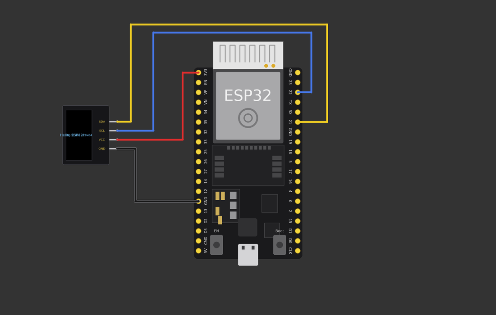

## 💻 Code

```cpp
// Lab 11 - OLED display (SSD1306, 128x64, I2C)
// SDA -> GPIO 21, SCL -> GPIO 22, VCC -> 3V3, GND -> GND
// Libraries: Adafruit SSD1306 + Adafruit GFX Library

#include <Wire.h>
#include <Adafruit_GFX.h>
#include <Adafruit_SSD1306.h>

const int SCREEN_WIDTH = 128;
const int SCREEN_HEIGHT = 64;
const int OLED_ADDRESS = 0x3C;     // the I2C "street number" of this display

Adafruit_SSD1306 display(SCREEN_WIDTH, SCREEN_HEIGHT, &Wire, -1);

int counter = 0;

void setup() {
  Serial.begin(115200);
  Wire.begin(21, 22);              // SDA = 21, SCL = 22

  if (!display.begin(SSD1306_SWITCHCAPVCC, OLED_ADDRESS)) {
    Serial.println("OLED not found - check SDA/SCL wires!");
    while (true) { delay(1000); }  // stop here
  }

  display.clearDisplay();
  display.setTextColor(SSD1306_WHITE);
  display.setTextSize(1);
  display.setCursor(0, 0);
  display.println("Hello, ESP32!");
  display.display();               // nothing appears until display() is called
  delay(1500);
}

void loop() {
  // a made-up "sensor value" that slowly rises and falls (0 - 100)
  int fakeSensor = 50 + 50 * sin(counter / 10.0);

  display.clearDisplay();
  display.setCursor(0, 0);
  display.setTextSize(1);
  display.println("ESP32 + OLED");
  display.println();
  display.print("Uptime: ");
  display.print(millis() / 1000);
  display.println(" s");
  display.print("Counter: ");
  display.println(counter);
  display.setTextSize(2);
  display.print("S=");
  display.print(fakeSensor);
  display.display();

  counter++;
  delay(200);
}
```

> 📦 Libraries (Wokwi library manager): **Adafruit SSD1306** and **Adafruit GFX Library**.
>
> The SDA and SCL wires run over the top of the board to GPIO 21 and 22 on the right-hand side.

### 🔗 Wiring table

| From | To | Purpose |
|---|---|---|
| OLED VCC | ESP32 3V3 | power |
| OLED GND | ESP32 GND | ground |
| OLED SDA | ESP32 GPIO 21 | I²C data |
| OLED SCL | ESP32 GPIO 22 | I²C clock |

## 🧠 Code explained (line by line)

* `#include <Wire.h>`  
  The I²C library (Arduino calls I²C *Wire*).
* `Adafruit_SSD1306 display(128, 64, &Wire, -1);`  
  Creates the display object: width, height, which I²C bus, and `-1` = no reset pin.
* `Wire.begin(21, 22);`  
  Starts I²C using GPIO 21 for SDA and 22 for SCL.
* `display.begin(SSD1306_SWITCHCAPVCC, 0x3C)`  
  Starts the display. `0x3C` is its I²C address. It returns false if the screen is not found.
* `display.clearDisplay();`  
  Erases the *memory buffer* (not yet the screen).
* `display.setCursor(0, 0); display.println(...)`  
  Places the text cursor and writes into the buffer.
* `display.display();`  
  Sends the buffer to the real screen. **Nothing shows until you call this!**
* `display.print(millis() / 1000);`  
  You can print numbers just like with Serial – this is how you display sensor values.

## 💡 Key ideas

**SDA and SCL for a complete beginner**

Imagine two people on a telephone line:

* **SDA** (*Serial DAta*) – the wire the **words** travel on.
* **SCL** (*Serial CLock*) – the wire that **beats time** so both know when each word starts.

Many devices can share the same two wires. Each has an **address** (like a house number) – this OLED is `0x3C` – so the ESP32 can
talk to just one of them. That is why I²C is great for robots: one display, one gyro and one sensor board can all use the same two pins.

## ✅ What I learned

- I²C needs only SDA + SCL (+ power and GND).
- Devices on the bus have addresses (OLED = 0x3C).
- Draw into the buffer, then call `display()` to show it.
- You can show sensor values on a display just like with Serial.

## 🚀 Mini challenge

1. Connect the potentiometer (Lab 5) and show its percentage on the OLED.
2. Show `OBSTACLE!` in large text when the HC-SR04 sees something closer than 20 cm.

[⬆ back to roadmap](#-learning-roadmap)

---

<a name="lab-12"></a>

# 🧪 Lab 12 — DC MOTOR + MOTOR DRIVER (L298N)

## 🎯 Goal

Drive a motor **safely**. You will learn why an ESP32 pin can never power a motor directly and how an L298N driver lets a tiny
3.3 V signal control a big, hungry motor – in both directions and at any speed.

**Parts:** ESP32 DevKit · L298N motor driver · DC motor · Battery pack (e.g. 7.4 V)

## 🔌 Circuit

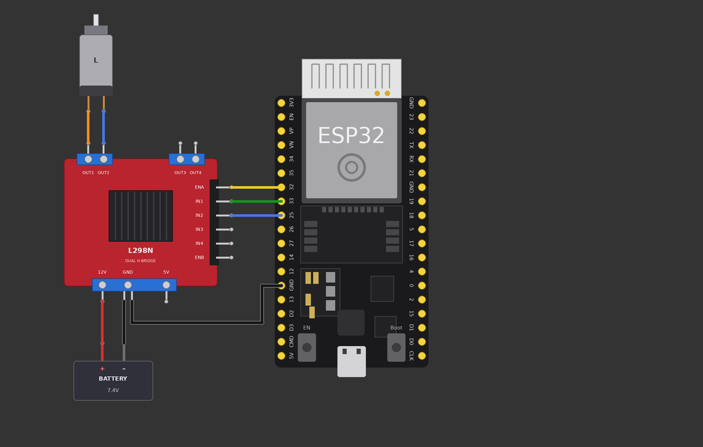

## 💻 Code

```cpp
// Lab 12 - DC motor + L298N motor driver (needs ESP32 Arduino core 3.x)
// ENA -> GPIO 32 (PWM speed), IN1 -> GPIO 33, IN2 -> GPIO 25
// L298N: 12V terminal <- battery +, GND terminal <- battery - AND ESP32 GND
// Motor A connects to OUT1 / OUT2. Remove the ENA jumper so PWM can work.

const int ENA = 32;
const int IN1 = 33;
const int IN2 = 25;

const int PWM_FREQ = 1000;
const int PWM_RES = 8;      // duty 0 ... 255

void setup() {
  pinMode(IN1, OUTPUT);
  pinMode(IN2, OUTPUT);
  ledcAttach(ENA, PWM_FREQ, PWM_RES);
}

void motorForward(int speed) {
  digitalWrite(IN1, HIGH);
  digitalWrite(IN2, LOW);
  ledcWrite(ENA, speed);
}

void motorBackward(int speed) {
  digitalWrite(IN1, LOW);
  digitalWrite(IN2, HIGH);
  ledcWrite(ENA, speed);
}

void motorStop() {
  digitalWrite(IN1, LOW);
  digitalWrite(IN2, LOW);
  ledcWrite(ENA, 0);
}

void loop() {
  motorForward(255);   // full speed forward
  delay(2000);
  motorStop();
  delay(1000);
  motorBackward(150);  // slower, backward
  delay(2000);
  motorStop();
  delay(1000);
}
```

> ⚠️ **Simulator note:** Wokwi's built-in parts do **not** include an L298N, a DC motor or an IR line sensor. The picture shows the **real
> hardware wiring** (what you will build on a physical robot). To test the code in Wokwi you can: (a) replace each motor with an LED
> (or two) on the L298N outputs, (b) use the community *chip-l298n* custom chip, and (c) use slide switches as IR sensors. The code
> does not change.
>
> 🔧 Remove the little jumper on **ENA** so PWM from the ESP32 controls the speed (with the jumper the motor is always at full speed).

### 🔗 Wiring table

| From | To | Purpose |
|---|---|---|
| ESP32 GPIO 32 | L298N ENA | speed (PWM) |
| ESP32 GPIO 33 | L298N IN1 | direction A |
| ESP32 GPIO 25 | L298N IN2 | direction B |
| L298N OUT1 / OUT2 | Motor terminals | motor power |
| Battery + | L298N 12V terminal | motor power in |
| Battery – | L298N GND terminal | motor power return |
| ESP32 GND | L298N GND terminal | **common ground** |

## 🧠 Code explained (line by line)

* `const int ENA = 32; IN1 = 33; IN2 = 25;`  
  Three control pins: **ENA** enables the motor and sets speed, **IN1/IN2** choose the direction.
* `ledcAttach(ENA, PWM_FREQ, PWM_RES);`  
  Sets up PWM on ENA – same trick as dimming the LED in Lab 6.
* `motorForward(speed): IN1 HIGH, IN2 LOW`  
  Current flows one way through the motor → it spins forward.
* `motorBackward(speed): IN1 LOW, IN2 HIGH`  
  Swapped → current flows the other way → the motor spins backward.
* `motorStop(): both LOW, ENA 0`  
  No difference between the inputs = no push = stop.
* `ledcWrite(ENA, speed);`  
  0–255 sets how fast: 255 full speed, 150 about 60 %.

## 💡 Key ideas

**Why can't a GPIO drive a motor directly?**
* An ESP32 pin gives only a few **milli**amps; a small motor wants hundreds of mA, and more when starting or stalled.
* A motor is a coil: when switched off it kicks back voltage spikes that can **destroy** the pin.

**The driver's job:** the ESP32 sends small *logic* signals; the L298N switches the big *battery* current (an **H-bridge**).

| IN1 | IN2 | Motor |
|---|---|---|
| HIGH | LOW | forward |
| LOW | HIGH | backward |
| LOW | LOW | stop |
| HIGH | HIGH | brake (avoid) |

**Common ground:** the ESP32 and the battery must share GND, otherwise the L298N cannot understand the logic signals.
In the picture the L298N GND terminal has **two** wires: one from the battery – and one to the ESP32.

**Power:** ESP32 from USB (or later from the battery); the motor from the battery on the 12V terminal.

## ✅ What I learned

- Never power a motor from a GPIO pin.
- A motor driver switches high current using small logic signals.
- IN1/IN2 set direction, ENA (PWM) sets speed.
- ESP32 and motor supply must share a common ground.

## 🚀 Mini challenge

1. Make the motor speed up smoothly from 0 to 255 and back (like Lab 6).
2. Use the pot (Lab 5) to set the motor speed.

[⬆ back to roadmap](#-learning-roadmap)

---

<a name="lab-13"></a>

# 🧪 Lab 13 — TWO MOTORS / ROBOT DRIVE

## 🎯 Goal

Drive a **robot**: two motors, left and right. By choosing what each wheel does you can go forward, backward, turn and spin.
This is called **differential drive**.

**Parts:** ESP32 DevKit · L298N motor driver · 2 × DC motor (left, right) · Battery pack

## 🔌 Circuit

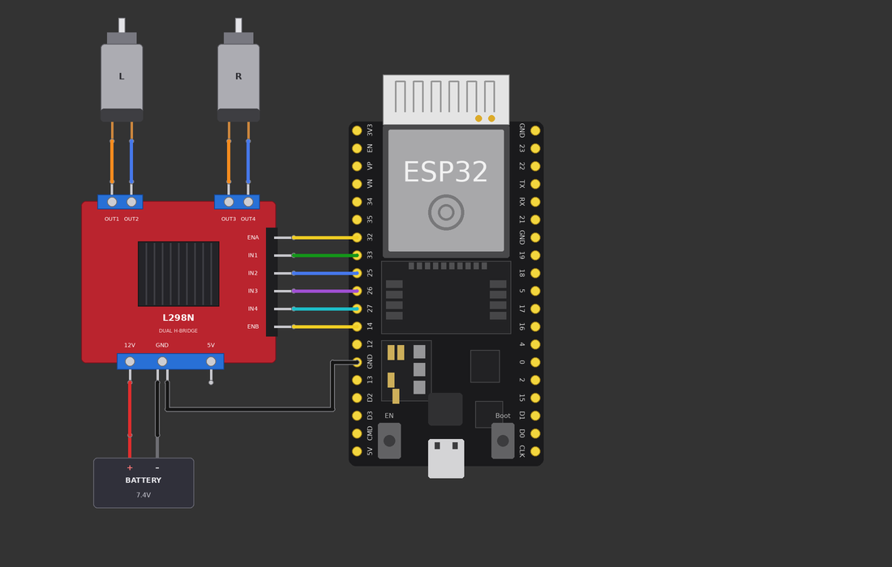

## 💻 Code

```cpp
// Lab 13 - Two motors / robot drive (needs ESP32 Arduino core 3.x)
// Left motor  (OUT1/OUT2): ENA = 32, IN1 = 33, IN2 = 25
// Right motor (OUT3/OUT4): ENB = 14, IN3 = 26, IN4 = 27

const int ENA = 32, IN1 = 33, IN2 = 25;   // left motor
const int ENB = 14, IN3 = 26, IN4 = 27;   // right motor

const int PWM_FREQ = 1000;
const int PWM_RES = 8;

void setup() {
  pinMode(IN1, OUTPUT); pinMode(IN2, OUTPUT);
  pinMode(IN3, OUTPUT); pinMode(IN4, OUTPUT);
  ledcAttach(ENA, PWM_FREQ, PWM_RES);
  ledcAttach(ENB, PWM_FREQ, PWM_RES);
}

// Each side: direction (+1 forward, -1 backward, 0 stop) and speed 0-255
void setLeft(int dir, int speed) {
  digitalWrite(IN1, dir > 0);
  digitalWrite(IN2, dir < 0);
  ledcWrite(ENA, dir == 0 ? 0 : speed);
}

void setRight(int dir, int speed) {
  digitalWrite(IN3, dir > 0);
  digitalWrite(IN4, dir < 0);
  ledcWrite(ENB, dir == 0 ? 0 : speed);
}

void forward(int s)   { setLeft(+1, s); setRight(+1, s); }
void backward(int s)  { setLeft(-1, s); setRight(-1, s); }
void turnLeft(int s)  { setLeft(0, 0);  setRight(+1, s); }   // only right wheel drives
void turnRight(int s) { setLeft(+1, s); setRight(0, 0);  }   // only left wheel drives
void spinLeft(int s)  { setLeft(-1, s); setRight(+1, s); }   // wheels in opposite directions
void stopAll()        { setLeft(0, 0);  setRight(0, 0);  }

void loop() {
  forward(200);   delay(2000);
  stopAll();      delay(500);
  turnLeft(200);  delay(1000);
  turnRight(200); delay(1000);
  backward(200);  delay(2000);
  spinLeft(200);  delay(1000);
  stopAll();      delay(2000);
}
```

> ⚠️ **Simulator note:** Wokwi's built-in parts do **not** include an L298N, a DC motor or an IR line sensor. The picture shows the **real
> hardware wiring** (what you will build on a physical robot). To test the code in Wokwi you can: (a) replace each motor with an LED
> (or two) on the L298N outputs, (b) use the community *chip-l298n* custom chip, and (c) use slide switches as IR sensors. The code
> does not change.

### 🔗 Wiring table

| From | To | Purpose |
|---|---|---|
| GPIO 32 / 33 / 25 | L298N ENA / IN1 / IN2 | left motor control |
| GPIO 14 / 26 / 27 | L298N ENB / IN3 / IN4 | right motor control |
| OUT1 / OUT2 | Left motor |  |
| OUT3 / OUT4 | Right motor |  |
| Battery + / – | L298N 12V / GND | motor power |
| ESP32 GND | L298N GND | common ground |

## 🧠 Code explained (line by line)

* `setLeft(int dir, int speed)`  
  One helper function controls one motor: `dir` is +1 forward, −1 backward, 0 stop.
* `digitalWrite(IN1, dir > 0);`  
  `dir > 0` is true (1 = HIGH) only for forward, so this single line sets IN1. Same idea for IN2 with `dir < 0`.
* `void forward(int s) { setLeft(+1, s); setRight(+1, s); }`  
  Small named functions (`forward`, `backward`, `turnLeft`…) hide the details. `loop()` now reads like a story.
* `turnLeft: left stop, right forward`  
  The right wheel pushes while the left stays still – the robot curves to the left.
* `spinLeft: left backward, right forward`  
  Wheels turn in opposite directions – the robot rotates on the spot.

## 💡 Key ideas

**Differential drive – how the wheels steer the robot**

| Left motor | Right motor | Robot does |
|---|---|---|
| forward | forward | **drives forward** |
| backward | backward | **drives backward** |
| stop | forward | **turns left** (pivots around the left wheel) |
| forward | stop | **turns right** |
| backward | forward | **spins left** on the spot |
| forward | backward | **spins right** on the spot |
| stop | stop | **stops** |

There is no steering wheel: the *difference* between the two wheel speeds steers the robot. Slow one wheel a little and you get a gentle curve – exactly what line following needs.

If your robot turns the wrong way, swap the two wires of that motor (or swap the code directions).

## ✅ What I learned

- Two motors + one driver make a robot base.
- Steering = giving the wheels different states.
- Helper functions make robot code readable.
- Wheel direction can be fixed by swapping motor wires.

## 🚀 Mini challenge

1. Drive a square: forward 1 s, turn right ~0.6 s, repeat 4 times.
2. Add a `curveLeft()` function with left speed 100 and right speed 220.

[⬆ back to roadmap](#-learning-roadmap)

---

<a name="lab-14"></a>

# 🧪 Lab 14 — LINE FOLLOWING

## 🎯 Goal

Make the robot **follow a black line** using two IR sensors. The sensors look at the floor; the code decides how to correct the steering.

**Parts:** ESP32 DevKit · L298N driver · 2 × DC motors · 2 × IR line sensors · Battery pack

## 🔌 Circuit

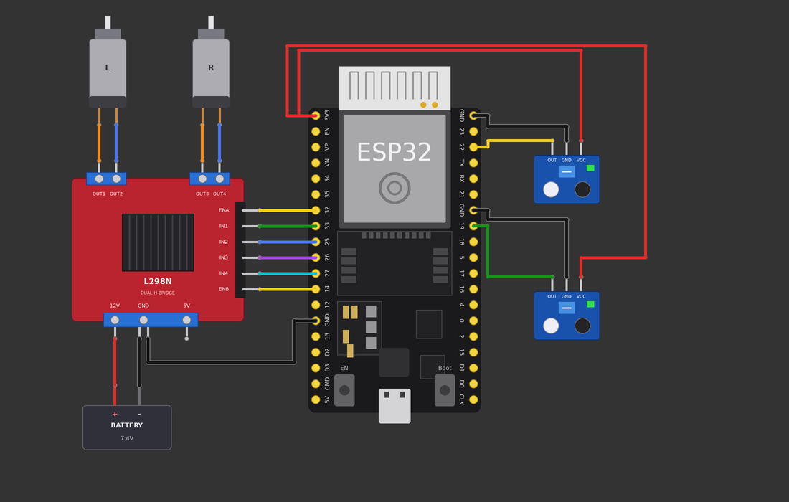

## 💻 Code

```cpp
// Lab 14 - Line following (2 IR sensors + L298N + 2 motors)
// Needs ESP32 Arduino core 3.x.
// IR left -> GPIO 22, IR right -> GPIO 19   (HIGH = sees the black line)
// Left motor : ENA 32, IN1 33, IN2 25   Right motor: ENB 14, IN3 26, IN4 27
// Wokwi has no IR line sensor: use two slide switches to play the sensors.

const int IR_LEFT = 22;
const int IR_RIGHT = 19;

const int ENA = 32, IN1 = 33, IN2 = 25;
const int ENB = 14, IN3 = 26, IN4 = 27;

const int BASE_SPEED = 170;   // 0-255
const int TURN_SPEED = 170;

void setLeft(int dir, int speed) {
  digitalWrite(IN1, dir > 0);
  digitalWrite(IN2, dir < 0);
  ledcWrite(ENA, dir == 0 ? 0 : speed);
}
void setRight(int dir, int speed) {
  digitalWrite(IN3, dir > 0);
  digitalWrite(IN4, dir < 0);
  ledcWrite(ENB, dir == 0 ? 0 : speed);
}

void setup() {
  Serial.begin(115200);
  pinMode(IR_LEFT, INPUT);
  pinMode(IR_RIGHT, INPUT);
  pinMode(IN1, OUTPUT); pinMode(IN2, OUTPUT);
  pinMode(IN3, OUTPUT); pinMode(IN4, OUTPUT);
  ledcAttach(ENA, 1000, 8);
  ledcAttach(ENB, 1000, 8);
}

void loop() {
  bool leftOnLine = digitalRead(IR_LEFT) == HIGH;
  bool rightOnLine = digitalRead(IR_RIGHT) == HIGH;

  if (!leftOnLine && !rightOnLine) {          // line is between the sensors
    setLeft(+1, BASE_SPEED); setRight(+1, BASE_SPEED);
    Serial.println("FORWARD");
  } else if (leftOnLine && !rightOnLine) {    // line drifted to the left
    setLeft(0, 0);           setRight(+1, TURN_SPEED);
    Serial.println("TURN LEFT");
  } else if (!leftOnLine && rightOnLine) {    // line drifted to the right
    setLeft(+1, TURN_SPEED); setRight(0, 0);
    Serial.println("TURN RIGHT");
  } else {                                    // both on black: junction / finish
    setLeft(0, 0);           setRight(0, 0);
    Serial.println("STOP");
  }
  delay(20);
}
```

> ⚠️ **Simulator note:** Wokwi's built-in parts do **not** include an L298N, a DC motor or an IR line sensor. The picture shows the **real
> hardware wiring** (what you will build on a physical robot). To test the code in Wokwi you can: (a) replace each motor with an LED
> (or two) on the L298N outputs, (b) use the community *chip-l298n* custom chip, and (c) use slide switches as IR sensors. The code
> does not change.

### 🔗 Wiring table

| From | To | Purpose |
|---|---|---|
| IR left OUT | ESP32 GPIO 22 | left sensor |
| IR right OUT | ESP32 GPIO 19 | right sensor |
| IR VCC (both) | ESP32 3V3 | power |
| IR GND (left / right) | ESP32 GND pins | ground |
| GPIO 32/33/25 and 14/26/27 | L298N ENA/IN1/IN2 and ENB/IN3/IN4 | motors |
| Battery + / –, ESP32 GND | L298N 12V / GND | power + common ground |

## 🧠 Code explained (line by line)

* `bool leftOnLine = digitalRead(IR_LEFT) == HIGH;`  
  Turns the reading into a clear true/false variable: *is the left sensor over the black line?*
* `if (!leftOnLine && !rightOnLine)`  
  `!` = NOT. Neither sensor sees black → the line is **between** the sensors → go straight.
* `else if (leftOnLine && !rightOnLine)`  
  Only the left sensor sees black → the robot has drifted right of the line → steer **left**.
* `else if (!leftOnLine && rightOnLine)`  
  Only the right sensor sees black → steer **right**.
* `else { stop }`  
  Both see black: a crossing or the finish mark → stop.
* `delay(20);`  
  Short pause; for real robots you will replace it with `millis()` timing (Lab 7).

## 💡 Key ideas

**The idea:** put the two sensors **either side** of the line. When the line is centred, neither sees it.

```
      line
   [L]  ┃  [R]       both white → FORWARD
   [L]┃     [R]       left sees line → TURN LEFT
   [L]     ┃[R]       right sees line → TURN RIGHT
```

| LEFT sensor | RIGHT sensor | Meaning | ACTION |
|---|---|---|---|
| white (LOW) | white (LOW) | line in the middle | **forward** |
| **black (HIGH)** | white (LOW) | line is to the left | **turn left** |
| white (LOW) | **black (HIGH)** | line is to the right | **turn right** |
| black (HIGH) | black (HIGH) | crossing / end | **stop** |

(Table assumes HIGH = black line. If your module is the opposite, flip the comparisons.)

## ✅ What I learned

- Read several sensors, then decide using `if / else if`.
- Sensors either side of the line give 'left' and 'right' corrections.
- Turning only one wheel is a simple correction method.
- Use `bool` variables to keep logic readable.

## 🚀 Mini challenge

1. Make turns gentler: slow the inner wheel (speed 80) instead of stopping it.
2. Remember the last turn direction and use it to find the line again if both sensors lose it.

[⬆ back to roadmap](#-learning-roadmap)

---

<a name="lab-15"></a>

# 🧪 Lab 15 — ESP32 WI-FI

## 🎯 Goal

Connect the ESP32 to a Wi-Fi network – the first step towards sending data, remote control and dashboards.

**Parts:** ESP32 DevKit · Red LED + 220 Ω resistor (connection status)

## 🔌 Circuit

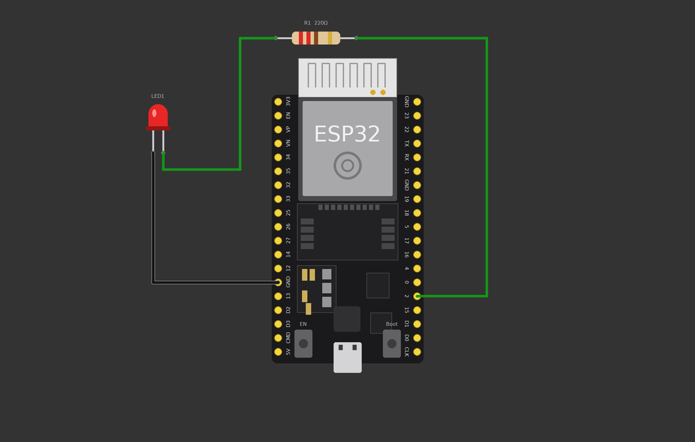

## 💻 Code

```cpp
// Lab 15 - ESP32 Wi-Fi
// In Wokwi, connect to the free simulated network "Wokwi-GUEST" (no password).
// Status LED + 220 ohm resistor on GPIO 2: ON = connected.

#include <WiFi.h>

const char* WIFI_SSID = "Wokwi-GUEST";   // network name
const char* WIFI_PASSWORD = "";          // no password on Wokwi-GUEST
const int WIFI_CHANNEL = 6;              // Wokwi speeds up connection on channel 6
const int LED_PIN = 2;

void setup() {
  Serial.begin(115200);
  pinMode(LED_PIN, OUTPUT);

  Serial.print("Connecting to Wi-Fi ");
  Serial.println(WIFI_SSID);
  WiFi.begin(WIFI_SSID, WIFI_PASSWORD, WIFI_CHANNEL);

  while (WiFi.status() != WL_CONNECTED) {   // wait until connected
    delay(250);
    Serial.print(".");
    digitalWrite(LED_PIN, !digitalRead(LED_PIN));  // blink while connecting
  }

  digitalWrite(LED_PIN, HIGH);              // solid ON = connected
  Serial.println();
  Serial.println("Connected!");
  Serial.print("IP address: ");
  Serial.println(WiFi.localIP());
  Serial.print("Signal strength (RSSI): ");
  Serial.print(WiFi.RSSI());
  Serial.println(" dBm");
}

void loop() {
  if (WiFi.status() != WL_CONNECTED) {      // lost the connection?
    digitalWrite(LED_PIN, LOW);
    Serial.println("Wi-Fi lost, reconnecting...");
    WiFi.reconnect();
    delay(2000);
  } else {
    digitalWrite(LED_PIN, HIGH);
  }
  delay(1000);
}
```

> 🌐 **Wokwi Wi-Fi:** the simulator provides a free open network called **`Wokwi-GUEST`** with **no password**. Use channel 6 for a faster
> connection. Nothing needs wiring for Wi-Fi – it is built into the ESP32.

### 🔗 Wiring table

| From | To | Purpose |
|---|---|---|
| ESP32 GPIO 2 | 220 Ω → LED anode | status LED |
| LED cathode | ESP32 GND | return path |

## 🧠 Code explained (line by line)

* `#include <WiFi.h>`  
  Loads the ESP32 Wi-Fi library.
* `const char* WIFI_SSID = "Wokwi-GUEST";`  
  The network name. `const char*` is how text is stored for this function.
* `WiFi.begin(WIFI_SSID, WIFI_PASSWORD, WIFI_CHANNEL);`  
  Starts connecting. The ESP32 keeps working in the background while it connects.
* `while (WiFi.status() != WL_CONNECTED)`  
  Loop until connected. `!=` means *not equal*. `WL_CONNECTED` is the 'success' status.
* `digitalWrite(LED_PIN, !digitalRead(LED_PIN));`  
  Reads the LED's current state and writes the opposite – so it blinks while connecting.
* `WiFi.localIP()`  
  The **IP address** the router gave the ESP32.
* `WiFi.RSSI()`  
  Signal strength in dBm (closer to 0 = stronger; −50 is great, −90 is weak).
* `WiFi.reconnect()`  
  If the connection drops, try again.

## 💡 Key ideas

**Wi-Fi words in simple language**

| Term | Meaning |
|---|---|
| **SSID** | The *name* of the Wi-Fi network you see in the list. |
| **Password** | The secret key to join (Wokwi-GUEST has none). |
| **Router / access point** | The box that creates the network. |
| **IP address** | The ESP32's *house number* on the network (e.g. `10.13.37.2`). |
| **Channel** | A radio 'lane' (1–13) the router uses. |
| **RSSI** | How strong the signal is. |
| **Station mode** | The ESP32 *joins* a network (what we did). |

Remember: ESP32 Wi-Fi supports **2.4 GHz** only (not 5 GHz).

## ✅ What I learned

- `WiFi.begin()` connects; `WiFi.status()` tells if it worked.
- An SSID is the network name; an IP address identifies the ESP32.
- The Wokwi network is `Wokwi-GUEST`, no password.
- Wait for the connection before using the network, and handle drops.

## 🚀 Mini challenge

1. Print the Wi-Fi **MAC address** (`WiFi.macAddress()`).
2. Fetch the time from the internet using `configTime()` (search 'ESP32 NTP Wokwi').

[⬆ back to roadmap](#-learning-roadmap)

---

<a name="lab-16"></a>

# 🧪 Lab 16 — FINAL DELIVERY ROBOT

## 🎯 Goal

Combine everything into one robot: it **follows a line**, **stops for obstacles**, **delivers an object with a servo** at the end of the line, and
**reports its status**.

**Parts:** ESP32 DevKit · L298N + 2 DC motors + battery · 2 × IR line sensors · HC-SR04 ultrasonic · Servo (delivery gate)

## 🔌 Circuit

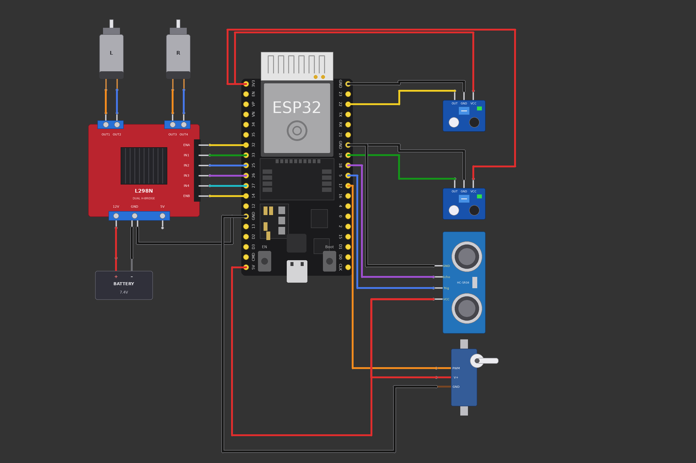

## 💻 Code

```cpp
// Lab 16 - FINAL PROJECT: Line-following delivery robot
// Needs ESP32 Arduino core 3.x and the ESP32Servo library.
//
// IR left -> 22, IR right -> 19          (HIGH = sees the black line)
// HC-SR04 TRIG -> 5, ECHO -> 18
// Servo (delivery gate) -> 17
// L298N left motor : ENA 32, IN1 33, IN2 25
// L298N right motor: ENB 14, IN3 26, IN4 27

#include <ESP32Servo.h>

const int IR_LEFT = 22, IR_RIGHT = 19;
const int TRIG_PIN = 5, ECHO_PIN = 18;
const int SERVO_PIN = 17;
const int ENA = 32, IN1 = 33, IN2 = 25;
const int ENB = 14, IN3 = 26, IN4 = 27;

const int SPEED = 170;                 // motor speed 0-255
const int OBSTACLE_CM = 15;            // stop if something is closer than this
const unsigned long CLEAR_TIME = 1000; // path must be clear this long (ms)

enum State { FOLLOW, OBSTACLE, DELIVER, DONE };
State state = FOLLOW;
State lastShown = DONE;                // forces the first status print

Servo gate;
unsigned long clearSince = 0;

// ---------- motors ----------
void setLeft(int dir, int speed) {
  digitalWrite(IN1, dir > 0);
  digitalWrite(IN2, dir < 0);
  ledcWrite(ENA, dir == 0 ? 0 : speed);
}
void setRight(int dir, int speed) {
  digitalWrite(IN3, dir > 0);
  digitalWrite(IN4, dir < 0);
  ledcWrite(ENB, dir == 0 ? 0 : speed);
}
void stopMotors() { setLeft(0, 0); setRight(0, 0); }

// ---------- sensors ----------
float readDistanceCm() {
  digitalWrite(TRIG_PIN, LOW);  delayMicroseconds(2);
  digitalWrite(TRIG_PIN, HIGH); delayMicroseconds(10);
  digitalWrite(TRIG_PIN, LOW);
  long duration = pulseIn(ECHO_PIN, HIGH, 30000);   // 30 ms time-out
  if (duration == 0) return 999;                    // nothing heard
  return duration * 0.0343 / 2;
}

// Line following (Lab 14). Returns true when BOTH sensors see black = destination.
bool followLine() {
  bool l = digitalRead(IR_LEFT) == HIGH;
  bool r = digitalRead(IR_RIGHT) == HIGH;
  if (l && r)       { stopMotors(); return true; }
  else if (l)       { setLeft(0, 0);       setRight(+1, SPEED); }  // steer left
  else if (r)       { setLeft(+1, SPEED);  setRight(0, 0);      }  // steer right
  else              { setLeft(+1, SPEED);  setRight(+1, SPEED); }  // straight
  return false;
}

// ---------- status ----------
// Put OLED code here (Lab 11) if you add a display.
void showStatus() {
  if (state == lastShown) return;      // only print when the state changes
  lastShown = state;
  switch (state) {
    case FOLLOW:   Serial.println("STATUS: following line");        break;
    case OBSTACLE: Serial.println("STATUS: obstacle! waiting");     break;
    case DELIVER:  Serial.println("STATUS: delivering package");    break;
    case DONE:     Serial.println("STATUS: delivery complete");     break;
  }
}

void setup() {
  Serial.begin(115200);
  pinMode(IR_LEFT, INPUT);  pinMode(IR_RIGHT, INPUT);
  pinMode(TRIG_PIN, OUTPUT); pinMode(ECHO_PIN, INPUT);
  pinMode(IN1, OUTPUT); pinMode(IN2, OUTPUT);
  pinMode(IN3, OUTPUT); pinMode(IN4, OUTPUT);
  ledcAttach(ENA, 1000, 8);
  ledcAttach(ENB, 1000, 8);
  gate.attach(SERVO_PIN);
  gate.write(0);                       // gate closed
  stopMotors();
}

void loop() {
  showStatus();
  float distance = readDistanceCm();

  switch (state) {
    case FOLLOW:
      if (distance < OBSTACLE_CM) {            // something in the way
        stopMotors();
        clearSince = 0;
        state = OBSTACLE;
      } else if (followLine()) {               // reached the destination mark
        state = DELIVER;
      }
      break;

    case OBSTACLE:
      stopMotors();
      if (distance >= OBSTACLE_CM) {           // path looks clear...
        if (clearSince == 0) clearSince = millis();
        if (millis() - clearSince >= CLEAR_TIME) state = FOLLOW;   // ...for long enough
      } else {
        clearSince = 0;                        // blocked again - restart the timer
      }
      break;

    case DELIVER:
      stopMotors();
      showStatus();
      gate.write(90);                          // open the gate: package drops
      delay(1500);                             // robot is stopped, so a delay is OK here
      gate.write(0);                           // close the gate
      state = DONE;
      break;

    case DONE:
      stopMotors();                            // reset the ESP32 to run again
      break;
  }
  delay(20);
}
```

> ⚠️ **Simulator note:** Wokwi's built-in parts do **not** include an L298N, a DC motor or an IR line sensor. The picture shows the **real
> hardware wiring** (what you will build on a physical robot). To test the code in Wokwi you can: (a) replace each motor with an LED
> (or two) on the L298N outputs, (b) use the community *chip-l298n* custom chip, and (c) use slide switches as IR sensors. The code
> does not change.
>
> 📺 **Status display:** to keep the picture readable the status is shown in the **Serial Monitor** (and could be sent over Wi-Fi). If you want a
> screen, add the OLED from Lab 11 on SDA 21 / SCL 22 – the code has a clearly marked `showStatus()` function for it.
>
> ⚠️ On real hardware the servo should have its own 5 V supply (common GND) and the HC-SR04 ECHO needs a voltage divider (Lab 8).

### 🔗 Wiring table

| From | To | Purpose |
|---|---|---|
| IR left / right OUT | GPIO 22 / 19 | line sensors |
| HC-SR04 TRIG / ECHO | GPIO 5 / GPIO 18 | obstacle sensor |
| Servo signal | GPIO 17 | delivery gate |
| L298N ENA, IN1, IN2 | GPIO 32, 33, 25 | left motor |
| L298N IN3, IN4, ENB | GPIO 26, 27, 14 | right motor |
| IR sensors VCC | 3V3 |  |
| HC-SR04 VCC and servo V+ | 5V |  |
| All GND (sensors, servo, driver) | ESP32 GND pins | common ground |
| Battery + / – | L298N 12V / GND | motor power |

## 🧠 Code explained (line by line)

* `enum State { FOLLOW, OBSTACLE, DELIVER, DONE };`  
  A **state machine**: the robot is always in exactly one state. Each state has its own behaviour. This keeps a big program organised.
* `readDistanceCm()`  
  Lab 8 code wrapped in a function that returns centimetres (or 999 if nothing is heard).
* `followLine()`  
  Lab 14 code: read both IR sensors and steer. Returns `true` when both see black = destination mark.
* `case FOLLOW:`  
  Check the distance first. Obstacle closer than 15 cm → stop and go to OBSTACLE. Otherwise keep following the line. Destination mark → DELIVER.
* `case OBSTACLE:`  
  Stay stopped until the way is clear for 1 second, then continue following the line.
* `case DELIVER:`  
  Stop, move the servo to 90° (gate opens, object drops), wait, return to 0°, then DONE.
* `millis() for the obstacle timer`  
  The robot never uses a long `delay()` while driving – it must keep reading sensors (Lab 7).
* `showStatus()`  
  Prints the state **only when it changes**, so the monitor stays readable.

## 💡 Key ideas

```
FOLLOW LINE ──► DETECT OBSTACLE ──► STOP / WAIT ──► CONTINUE
                                                       │
                      SHOW STATUS ◄── DELIVER (servo) ◄── REACH DESTINATION
```

| State | What the robot does | Goes to next state when… |
|---|---|---|
| FOLLOW | line following (Lab 14) | obstacle < 15 cm → OBSTACLE; both sensors black → DELIVER |
| OBSTACLE | motors stopped | path clear for 1 s → FOLLOW |
| DELIVER | stop, servo opens then closes | finished → DONE |
| DONE | stay stopped | (reset the ESP32 for a new run) |

**Why it works:** each earlier lab is now one small function – digital outputs (1–4), PWM (6, 12), `millis()` (7), the ultrasonic sensor (8), the servo (9),
IR sensors (10, 14), motor drive (12–13) and Serial/Wi-Fi status (3, 15).

## ✅ What I learned

- Big projects = small tested pieces glued together with functions.
- A state machine keeps complex behaviour organised.
- Non-blocking timing keeps sensors alive while the robot waits.
- Always test each part alone first (that is what Labs 1–15 did).

## 🚀 Mini challenge

1. Add the OLED (Lab 11) to `showStatus()`.
2. Send the status to a web page over Wi-Fi (build on Lab 15).
3. Make the robot back up and go around the obstacle instead of waiting.

[⬆ back to roadmap](#-learning-roadmap)

---

## 🏁 What's next

* Add the OLED to the delivery robot and show live distance + state.
* Replace `if/else` line following with a **PID controller** and 3–5 sensors.
* Build the real robot: chassis, 2 wheels + caster, 7.4 V battery, buck converter for the ESP32.
* Send robot telemetry over Wi-Fi to a small web dashboard.

## 📁 Repository layout

```
ESP32-Basics-Wokwi/
├── README.md        ← this whole course
├── LICENSE
├── .gitignore
├── images/          ← circuit pictures lab01 … lab16
└── code/            ← one folder + .ino sketch per lab
```

Open any `code/labXX-…/labXX-….ino` in the Arduino IDE or paste it into a Wokwi ESP32 project.

## 📜 License

MIT – see [LICENSE](LICENSE). Learn, copy, remix, build robots. 🤖
